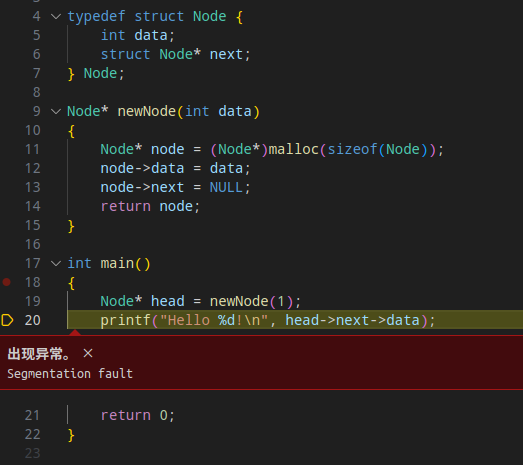
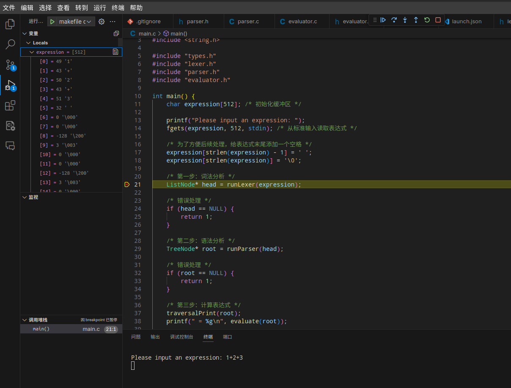

# Task 1: 配置 VSCode 和 C 语言开发环境

@Author:  斬風千雪 
@Email: me@chyk.ink

我一直习惯用 jb 家的 IDE，但是 root 分区没有空间再下一个 CLion 了，于是就用 VSCode 做了昨天的 C 语言作业。正好先锋也布置了用 VSCode 开发 C 语言的任务，就把过程写在这里。

### 安装 VSCode 和编译器等环境

```bash
sudo pacman -S base-devel gdb git
paru -S visual-studio-code-bin
```

### 配置 VSCode

首先写一些 Chromium 参数以让 VSCode 在 Wayland 上使用正确的缩放比例和输入法：

```conf ~/.config/code-flags.conf
--enable-features=UseOzonePlatform,WaylandWindowDecorations
--ozone-platform=wayland
--disable-features=WaylandFractionalScaleV1
--enable-wayland-ime
```

嗯，这就是我为什么不喜欢 electron。

之后启动 VSCode，安装 C / C++ 扩展包。

大功告成。

### 调试单个 C 语言文件

点右上角的运行和调试按钮，或者按 F5 选择「gcc 生成和调试活动文件」。之后 VSCode 会调用 gcc 编译当前文件并启动 gdb 进行调试。在调试时，会按照设置好的断点暂停，也会在报段错误时指出报错的行。同时 UI 上方会出现调试工具条，方便随时暂停代码。



### 调试工程

当 [某工程](https://github.com/chiyuki0325/CalculatorInC) 使用了 Makefile 或 CMake 构建时，单文件调试的方法已不再有效。这时候，就需要编辑 tasks.json 和 launch.json（[参考文献](https://blog.csdn.net/baidu_22429139/article/details/105125095)），之后，在左侧的「运行和调试」工具栏中选择目标运行。


