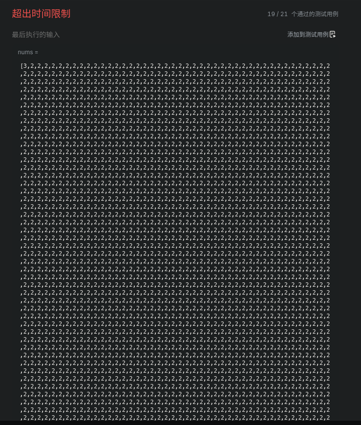

# Task 2: C 语言中的排序算法

@Author: 斬風千雪   
@Email: me@chyk.ink

在 main.c 文件中编写了最简单的冒泡排序和相对复杂的快速排序。

「哨兵」这个词单拿出来相对比较难理解，感觉可以理解成「基准」或者「分界线」...?

参考文献：

> https://www.hello-algo.com/chapter_sorting/bubble_sort/
>
> https://www.hello-algo.com/chapter_sorting/quick_sort/
> https://algo.itcharge.cn/01.Array/02.Array-Sort/06.Array-Quick-Sort/

实际问题：

https://leetcode.cn/problems/sort-an-array/

丧心病狂。。

